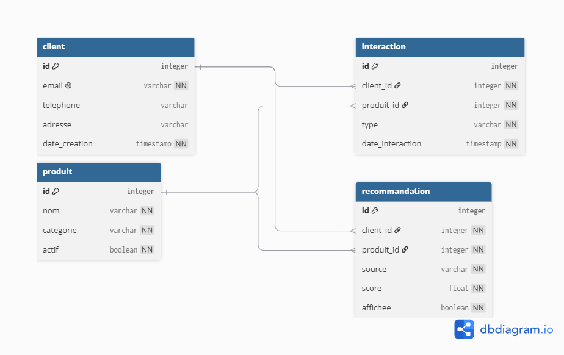

# Projet RGPD — Sézane

## 1. Site et fonctionnalité choisis

Site : **Sézane** (sezane.com) — marque française de prêt-à-porter, établie en France et soumise au RGPD.

Fonctionnalité : **Système de recommandation de produits** — suggestion personnalisée de produits basée sur les interactions (vues, likes, achats) et un score algorithmique.

---

## 2. Diagramme + Schéma



```sql
CREATE TABLE client (
    id              SERIAL PRIMARY KEY,
    email           VARCHAR(255) NOT NULL UNIQUE,
    telephone       VARCHAR(20),
    adresse         VARCHAR(255),
    date_creation   TIMESTAMP NOT NULL DEFAULT NOW()
);

CREATE TABLE produit (
    id          SERIAL PRIMARY KEY,
    nom         VARCHAR(255) NOT NULL,
    categorie   VARCHAR(100) NOT NULL,
    actif       BOOLEAN NOT NULL DEFAULT TRUE
);

CREATE TABLE interaction (
    id               SERIAL PRIMARY KEY,
    client_id        INTEGER NOT NULL REFERENCES client(id) ON DELETE CASCADE,
    produit_id       INTEGER NOT NULL REFERENCES produit(id) ON DELETE CASCADE,
    type             VARCHAR(50) NOT NULL
                         CHECK (type IN ('vue', 'like', 'achat', 'panier')),
    date_interaction TIMESTAMP NOT NULL DEFAULT NOW()
);

CREATE TABLE recommandation (
    id          SERIAL PRIMARY KEY,
    client_id   INTEGER NOT NULL REFERENCES client(id) ON DELETE CASCADE,
    produit_id  INTEGER NOT NULL REFERENCES produit(id) ON DELETE CASCADE,
    source      VARCHAR(100) NOT NULL
                    CHECK (source IN ('collaboratif', 'contenu', 'tendance')),
    score       FLOAT NOT NULL CHECK (score >= 0 AND score <= 1),
    affichee    BOOLEAN NOT NULL DEFAULT FALSE
);
```

---

## 3. Identification des données personnelles

### Données individuelles — colonne par colonne

| Donnée | Personnelle ? | Type | Justification / base légale |
|---|---|---|---|
| `client.id` | Oui | Indirecte | Seul, ne pose pas de problème, mais combiné à une autre donnée relie tous les comportements à une personne. |
| `client.email` | Oui | Directe | Identifie directement la personne ex(salma.tahiri@.......). |
| `client.telephone` | Oui | Directe | Identifie directement la personne. |
| `client.adresse` | Oui | Directe | Localise physiquement la personne à son domicile. |
| `client.date_creation` | Non seule | Indirecte | Seul, ne pose pas de problème, mais combiné à `client_id`, révèle tous les comportements d'achat de la personne. |
| `produit.id / nom / categorie / actif` | Non | — | Données relatives à un objet commercial, pas à une personne physique. |
| `interaction.type` | Non seule | Indirecte | Reliée à `client_id`, elle révèle des comportements, des goûts, voire des habitudes d'achat. |
| `interaction.date_interaction` | Non seule | Indirecte | Associé à `client_id`, révèle les horaires de connexion et rythmes de vie de la personne. |
| `recommandation.score` | Non seule | Indirecte | Associé à `client_id`, on reconstitue ainsi l'historique publicitaire du client. |

### Combinaisons ré-identifiantes

| Combinaison | Risque de ré-identification |
|---|---|
| `client_id` + `interaction.type` + `date_interaction` | Seuls, ne posent pas de problème, mais combinés, reconstituent l'historique complet de navigation : quels produits consultés, à quelle heure, dans quel ordre. |
| `client_id` + `recommandation.score` + `source` | Combinés, révèlent les centres d'intérêt et les habitudes d'achat du client. |
| `email` + `produit.categorie` + `interaction.type` | Combinés, permettent de révéler la situation personnelle du client. |
| `adresse` + `date_interaction` | Combinés, révèlent les habitudes de vie de la personne. |

---

## 4. Mentions légales

### Identification de l'éditeur (source : data.gouv.fr)

Le site sezane.com est édité par :

**Benda Bili SAS**
Société par Actions Simplifiée au capital de 27 386 €
Siège social : 115, rue du Bac – 75007 Paris, France
RCS Paris : 534 652 854
SIRET : 534 652 854 00124
Numéro de TVA intracommunautaire : FR39 534 652 854
Directrice de la publication : Morgane Sezalory (Présidente)
Email : hello@sezane.com

---

### Hébergeur (source : hostingchecker)

Le site sezane.com est hébergé par :

**Amazon Web Services (AWS)**
38, avenue John F. Kennedy – L-1855 Luxembourg
aws.amazon.com

---

### Activité commerciale

Les conditions générales de vente (CGV) applicables à toute commande passée
sur sezane.com sont accessibles à l'adresse : sezane.com/cgv

Conformément à l'article L. 612-1 du Code de la consommation, tout
consommateur a le droit de recourir gratuitement à un médiateur de la
consommation en vue de la résolution amiable d'un litige.

Médiateur compétent : **Médiateur du e-commerce de la FEVAD**
60, rue La Boétie – 75008 Paris
www.mediateurfevad.fr

---

### Protection des données personnelles (RGPD)

**Responsable de traitement**
Benda Bili SAS – 115, rue du Bac, 75007 Paris
Contact DPO : privacy@sezane.com

**Finalités et bases légales des traitements**

| Finalité | Base légale |
|---|---|
| Gestion du compte client (email, téléphone, adresse) | Exécution du contrat (art. 6.1.b RGPD) |
| Recommandations personnalisées (score, interactions) | Intérêt légitime (art. 6.1.f RGPD) |
| Profilage algorithmique des comportements d'achat | Intérêt légitime (art. 6.1.f RGPD) |
| Envoi d'emails marketing | Consentement (art. 6.1.a RGPD) |
| Cookies de mesure d'audience | Consentement (art. 6.1.a RGPD) |

**Durées de conservation**

| Donnée | Durée de conservation |
|---|---|
| Données du compte client (email, téléphone, adresse) | Durée de la relation contractuelle + 3 ans après résiliation |
| Historique des interactions (vues, likes, achats) | 3 ans à compter de la dernière interaction |
| Scores et recommandations | 1 an glissant |
| Données de facturation | 10 ans (obligation légale comptable) |
| Logs de connexion | 12 mois (obligation légale LCEN) |
| Cookies de consentement | 6 mois |

**Droits des personnes**

Vous disposez des droits suivants sur vos données :
- Droit d'accès (art. 15)
- Droit de rectification (art. 16)
- Droit à l'effacement (art. 17)
- Droit d'opposition (art. 21)
- Droit à la portabilité (art. 20)
- Droit à la limitation du traitement (art. 18)

Pour exercer vos droits, contactez-nous : privacy@sezane.com
Nous nous engageons à vous répondre dans un délai de 30 jours.

**Réclamation auprès de la CNIL**

Si vous estimez que vos droits ne sont pas respectés, vous pouvez déposer
une réclamation auprès de la CNIL :
3, place de Fontenoy – TSA 80715 – 75334 Paris Cedex 07
www.cnil.fr

**Cookies**

Le site sezane.com utilise des cookies nécessaires au bon fonctionnement du
site, ainsi que des cookies analytiques soumis à votre consentement.
Vous pouvez gérer vos préférences via le bandeau cookies lors de votre
première visite, ou à tout moment depuis les paramètres du site.

---

### Propriété intellectuelle

Tous les contenus présents sur sezane.com (textes, images, logos,
photographies, vidéos, etc.) sont la propriété de Benda Bili SAS ou de
ses partenaires, et sont protégés par le droit de la propriété
intellectuelle français.

Toute reproduction ou exploitation sans autorisation écrite de Benda Bili SAS
est interdite et constitue une contrefaçon (art. L.335-2 du Code de la
propriété intellectuelle).

---

## 5. Process de suppression — droit à l'effacement (art. 17 RGPD)

### Déclenchement de la demande

1. L'utilisateur envoie sa demande à privacy@sezane.com
2. Vérification de l'identité du demandeur (email correspondant à un client.id existant)
3. Accusé de réception envoyé sous 72h
4. Délai de traitement : 30 jours maximum (art. 12 RGPD)

### Vérification des exceptions avant suppression

Avant toute suppression, vérifier si une exception s'applique :

| Cas | Action |
|---|---|
| Commande en cours ou litige non résolu | Suspension de la suppression jusqu'à clôture |
| Données de facturation (10 ans) | Conservation obligatoire, non supprimables |
| Logs de connexion (12 mois LCEN) | Conservation obligatoire, non supprimables |

### Étapes de suppression

1. Supprimer toutes les recommandations liées au client
2. Supprimer toutes les interactions liées au client
3. Supprimer le compte client

> Les données produit ne sont pas touchées car elles ne contiennent aucune donnée personnelle.

### Confirmation à l'utilisateur

Envoyer un email de confirmation à l'utilisateur précisant :
- la date d'exécution de la suppression
- les données supprimées
- les données conservées et pourquoi (obligations légales)

### Traçabilité interne

Conserver dans un registre interne (hors base client) :
- la date de la demande
- la date d'exécution
- l'identifiant anonymisé du client traité
- le nom de l'opérateur ayant exécuté la suppression

> Cette traçabilité est nécessaire pour prouver la conformité en cas de contrôle CNIL, sans conserver les données supprimées.
