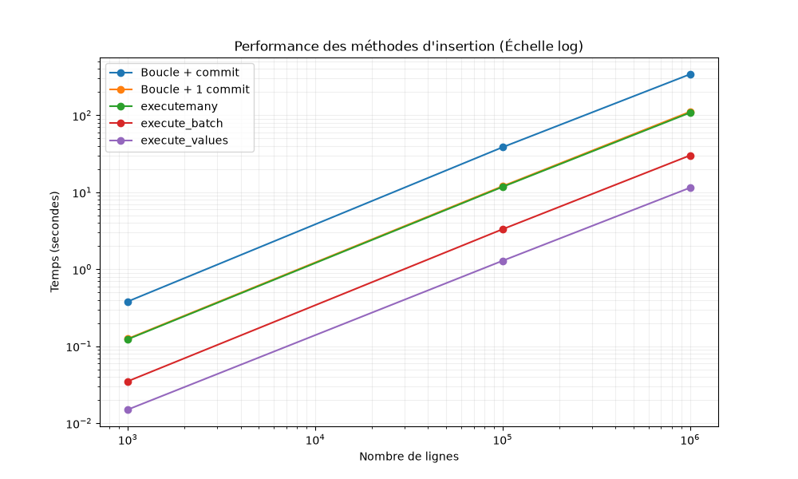

# Rapport de performance : Comparaison des méthodes d'insertion de données

Ce rapport présente les mesures de temps d'exécution pour l'insertion de jeux de données de différentes tailles (1 000, 100 000 et 1 000 000 de lignes) dans une base de données PostgreSQL.

## 1. Tableau récapitulatif des temps médians (en secondes)

| Méthode | 1 000 lignes | 100 000 lignes | 1 000 000 lignes |
| :--- | :---: | :---: | :---: |
| **1. Boucle `for` + `commit()` par ligne** | 0.381 | 38.536 | 341.781 |
| **2. Boucle `for` + 1 seul `commit()`** | 0.125 | 12.008 | 111.483 |
| **3. `cursor.executemany()`** | 0.123 | 11.760 | 108.240 |
| **4. `psycopg2.extras.execute_batch()`** | 0.035 | 3.313 | 30.116 |
| **5. `psycopg2.extras.execute_values()`** | 0.015 | 1.289 | 11.454 |

## 2. Visualisation des performances

Le graphique ci-dessous illustre l'évolution du temps d'exécution en fonction du nombre de lignes, en utilisant une **échelle logarithmique** sur les deux axes pour mettre en évidence les ordres de grandeur.

## 3. Analyse des écarts

Les tests montrent de grandes différences de vitesse selon la méthode utilisée. Voici pourquoi :

* **Le rôle de la transaction (`COMMIT`)** : Dans la méthode 1, le programme enregistre chaque ligne une par une sur le disque dur. C'est très lent. Dans la méthode 2, nous enregistrons tout en une seule fois à la fin, ce qui est environ trois fois plus rapide.
* **La réduction des échanges avec le serveur** : La méthode 1 est lente car elle fait un aller-retour entre Python et la base de données pour chaque ligne. Les méthodes comme `execute_batch` et `execute_values` envoient plusieurs lignes en même temps. Cela utilise moins d'énergie et demande moins de travail à l'ordinateur.
* **Choisir la bonne méthode** : Pour insérer beaucoup de données (1 million de lignes), il est nécessaire d'utiliser des méthodes rapides comme `execute_values`. C'est important pour que le programme fonctionne bien et rapidement, sans gaspiller les ressources de la machine.